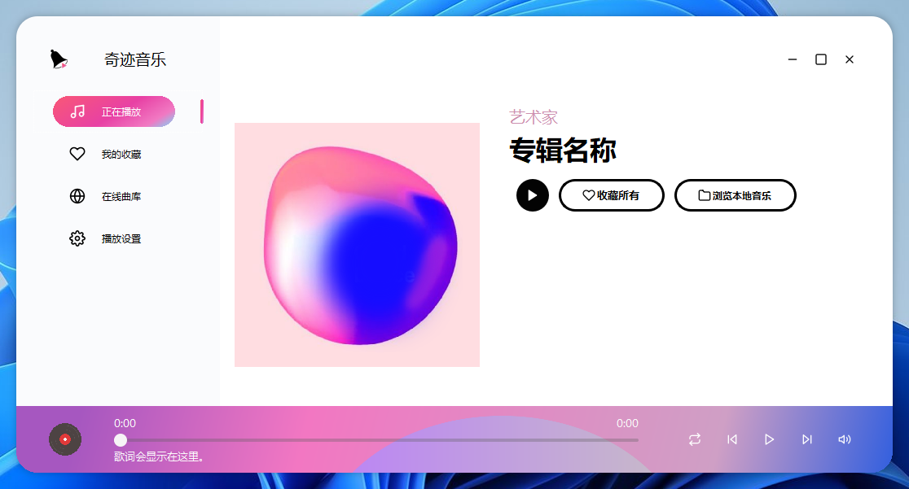

# 奇迹音乐播放器

      

## 介绍

程序设计上机作业，一个简单的音乐播放器，内置网易源和酷狗源。设计参考自Ahmed Manna的作品，图标来自[FeatherIcon](https://feathericons.com/)。

您可以随意下载、修改和使用本仓库的内容！使用Qt 6编写，Windows下需要额外安装MSVC而非MinGW版Qt编译器，需要Qt Multimedia组件。欢迎您提交贡献！

[GitHub仓库](https://www.github.com/VEXLife/MiraclePlayer/) [Gitee仓库](https://www.gitee.com/VEXLife/MiraclePlayer/)

## 使用截图

设计稿见[Dribbble](https://dribbble.com/shots/11775079-Music-Player-Web-Application)，如下：

使用截图（在Windows 11上使用Qt 6.4编译）：

我个人认为我还原得还是贴近的，不过我并未取得原作者许可，因此本项目仅供参考，禁止商用。

## 自行打包

您可以自行重新打包奇迹音乐，仓库中已提供NSIS和Inno Setup的打包脚本，见[说明文件](setup/README.md)。